# Write your own imaging processing UI in 15 minutes, using Kotlin and Compose for the Desktop

Compose used to be just a smooth way of writing Android Applications in Kotlin. Now JetBrains has ported Compose to the Desktop, and it's now easier than ever to protype UI in real-time. 

Of course, you can write a web app based UI, or a single page application, but sometimes, especially in the IoT world, and a small cluster of Raspberry Pis, the easiest way is to have actually a small Desktop UI.

A few months back, for a fast paced PoC, I had to set up a lot of AWS EC2 instances, lambdas, docker instances and had to monitor them, I actually reverted back to write a quick Desktop UI in compose just for that. And. it. works. great.

Today's article is about plugging in Compose with my de-facto Imaging/AI library, Origami, the only OpenCV wrapper for the JVM. The article will focus on the ease of use of Compose, and will leave apart any advanced thing that can be with Origami, so we will focus on writing a UI with a drag and drop area to accept an image, and when the image is shown, two sliders will accept a range of values for threadshold 1 and threadshold 2 of the opencv canny function.

The end result looks like this:

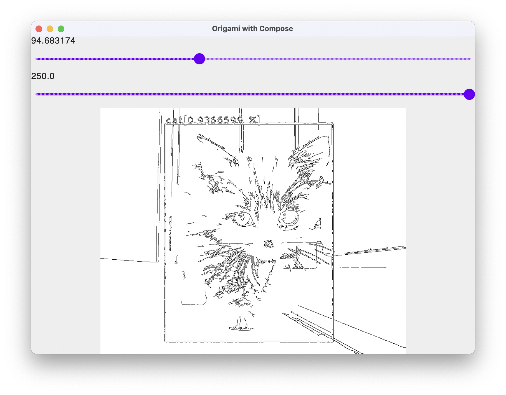

And if you have IntelliJ installed, we are targeting to take you there in less than 15 minutes. 

## Project Setup

Let's start by creating a new Compose/Desktop project in IntelliJ.

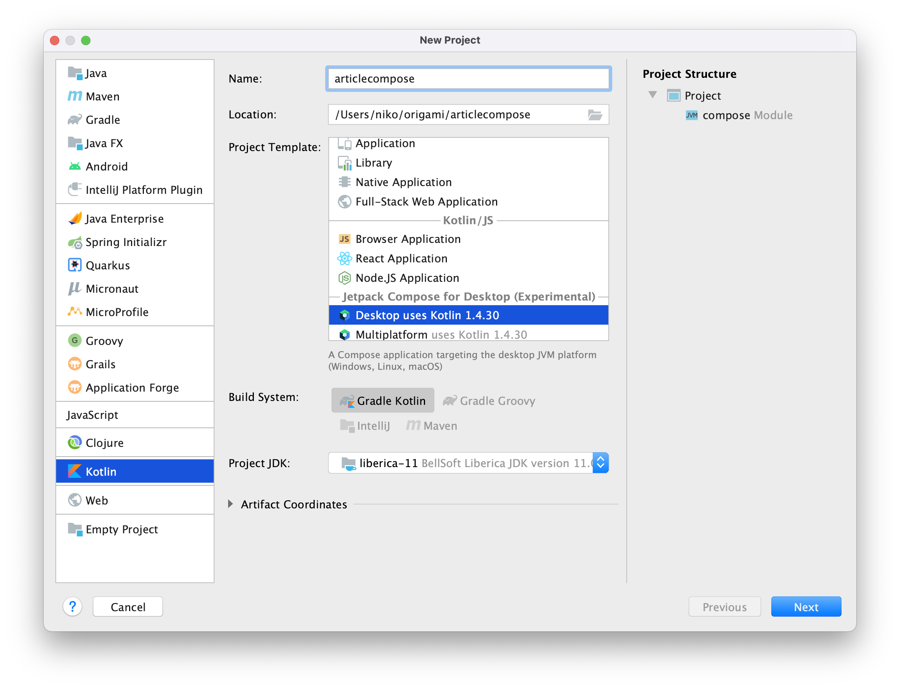

Any recent JVM will do, but let's keep a stable JVM version 11.

Settings for the New Project are straight forward, and we are keeping the proposed settings as is and clicking Finish.

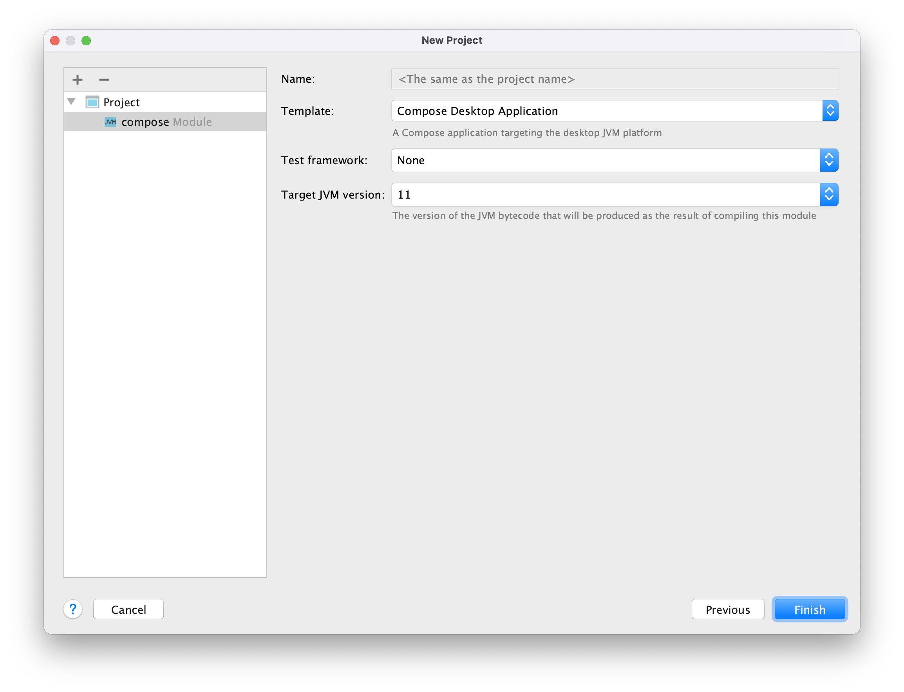

After you create the project, and open the main.kt file the setup should look like the screenshot below:

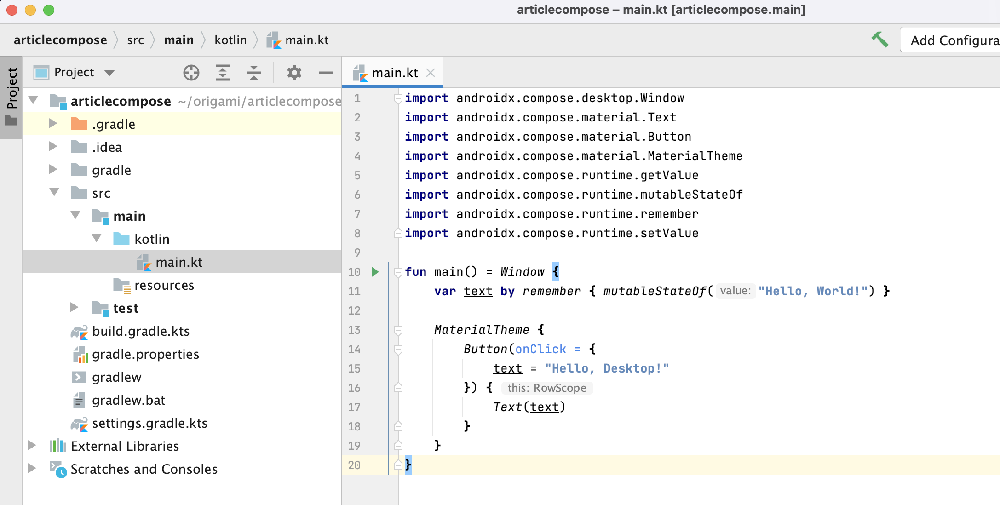

If you start the program by running the main function with:

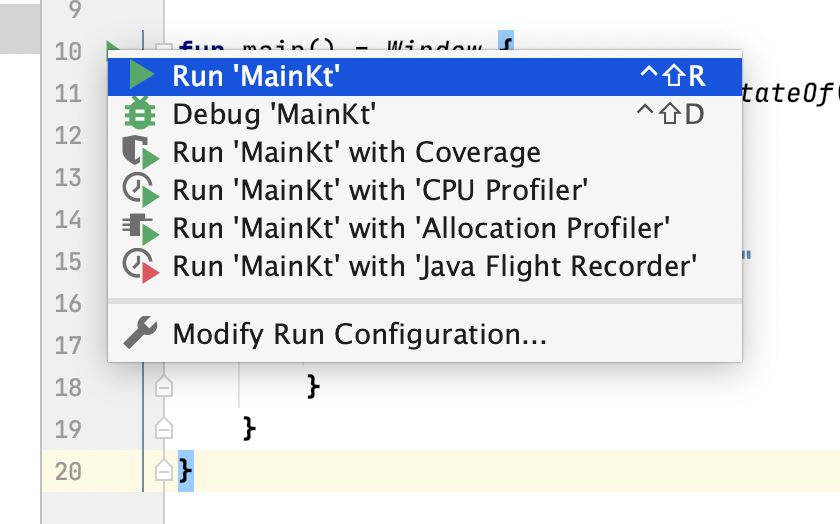


The original program simply displays a button displaying "Hello, World!" that reacts on a onClick event.

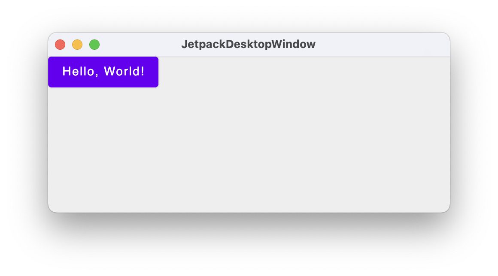

## Loading an image with Origami

To use Origami in your project, edit the build.gradle.ks file, and add the new repository

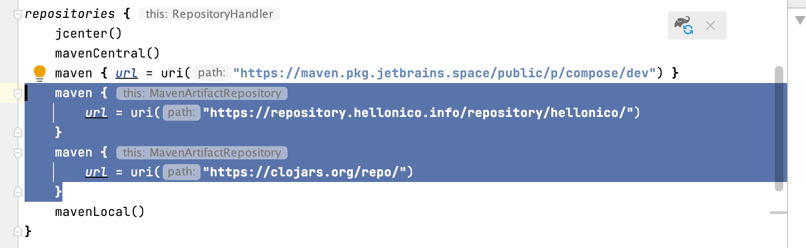

And the dependencies:


Origami Core and the filters are separated, so we add those two to the project.

You'll be asked to reload the gradle project settings, and this can be done by clicking the icon below:


You can now import the Origami library

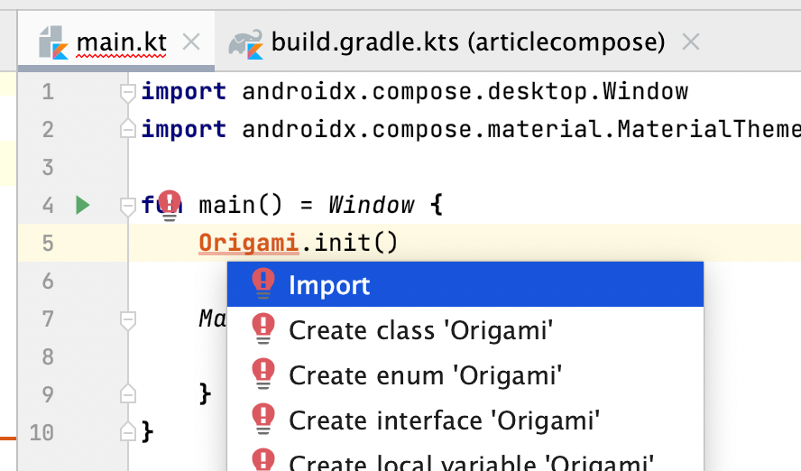

And your main.kt file should now look like this

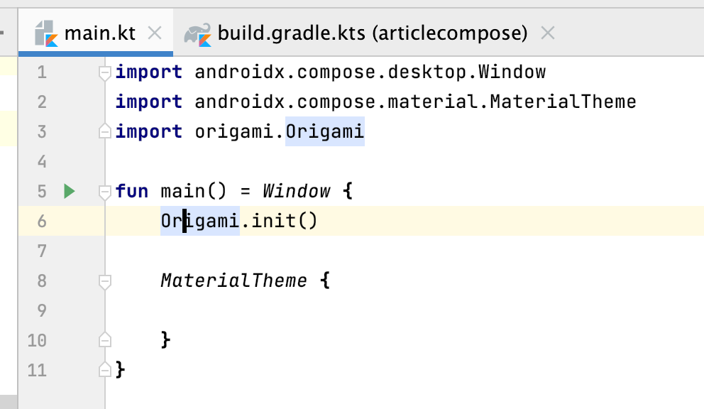

An image in Kotlin/Compose is quite easy to add with the Composable Image.

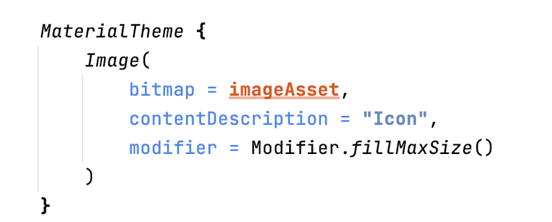

Image expects a bitmap, and Origami just like OpenCV works with Mat. So we will write a small function to convert a Mat to the expected bitmap.

```kotlin
fun asImageAsset(image: Mat): ImageBitmap {
    val bytes = MatOfByte()
    Imgcodecs.imencode(".jpg", image, bytes)
    val byteArray = ByteArray((image.total() * image.channels()).toInt())
    bytes.get(0, 0, byteArray)
    return org.jetbrains.skija.Image.makeFromEncoded(byteArray).asImageBitmap()
}
```

We encode the OpenCV mat object into bytes, representing the JPG version of the image, and then use that to load into an ImageBitmap using *makeFromEncoded*.

Then, we can just read the image using the usual OpenCV imread and convert to bitmap.

```kotlin
asImageAsset(imread(name))
```

Your main.kt file should now look like this:

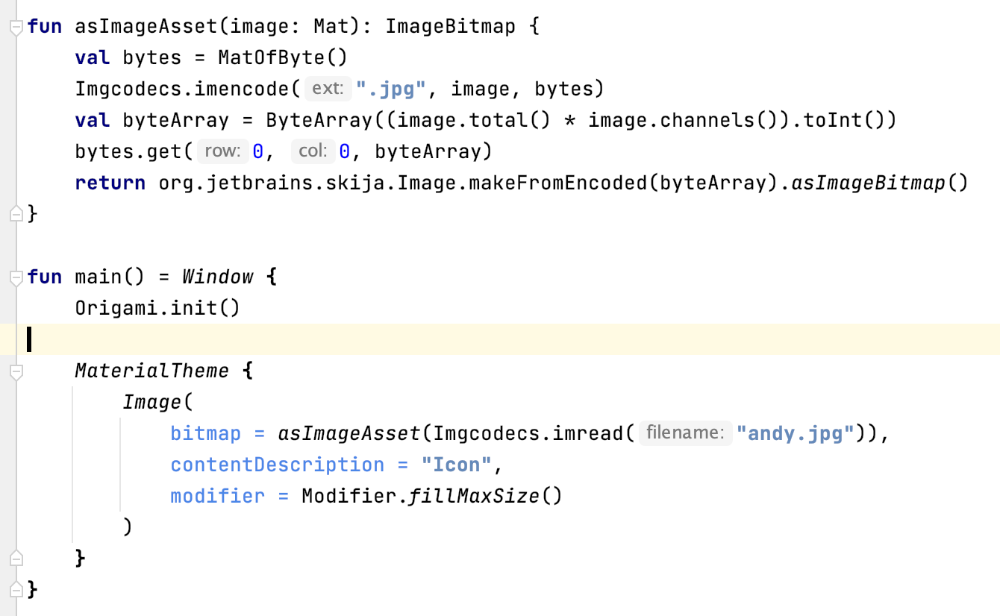

And if you run the kotlin code:


## Canny Effect

Before using the asImageAsset function, you're in the land of Origami, and so you can apply any filter you want. Replacing the bitmap parameter of the image with:

```kotlin
bitmap = asImageAsset(Canny().apply(Imgcodecs.imread("andy.jpg"))),
```

Will nicely give you:

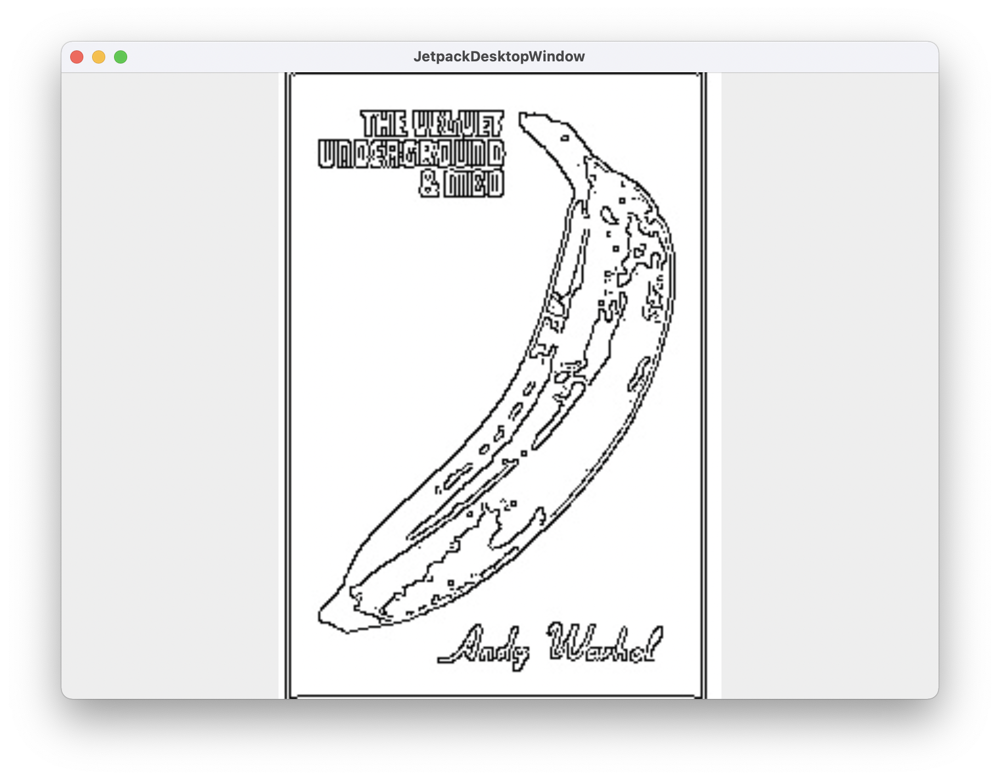


## Drag and drop

Drag and Drop is not natively supported yet by Kotlin / Compose *but* we can make it work with a bit of glue. Here we plug in into the underlying terrifying Java AWT Framework. Once the window receives a file, we change the value of the mutable *name* variable. 

```kotlin
    val name = remember { mutableStateOf("") }
    val target = object : DropTarget() {
        @Synchronized
        override fun drop(evt: DropTargetDropEvent) {
            evt.acceptDrop(DnDConstants.ACTION_REFERENCE)
            val droppedFiles = evt.transferable.getTransferData(DataFlavor.javaFileListFlavor) as List<*>
            droppedFiles.first()?.let {
                name.value = (it as File).absolutePath
            }
        }
    }
    AppManager.windows.first().window.contentPane.dropTarget = target
```

After that, our application will show a text field if no image has been dropped yet, and the image if it can. No error detection done here, so better be an image !

```kotlin
MaterialTheme {
        if (name.value == "") {
            Text("Drop a file . . .")
        } else {
            Image(
                bitmap = asImageAsset(Canny().apply(Imgcodecs.imread(name.value))),
                contentDescription = "Icon",
                modifier = Modifier.fillMaxSize()
            )
        }
}
```

Running the application will give:

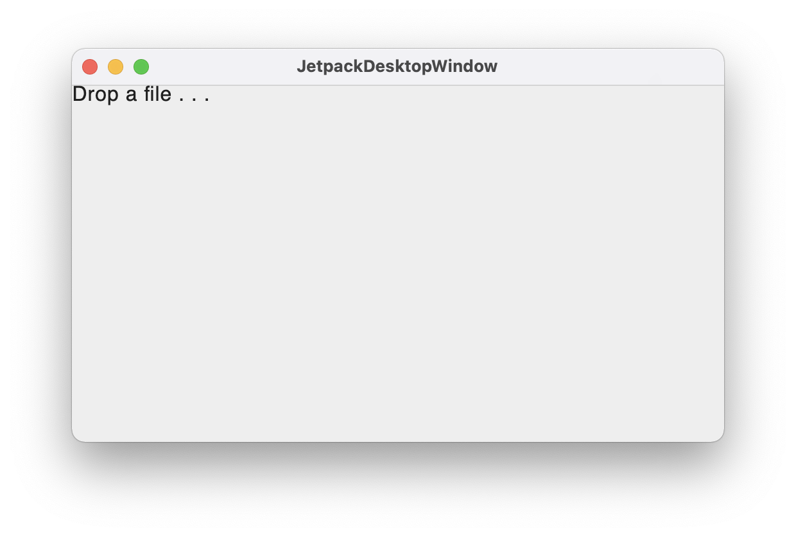

And once we have dropped the image file on the window, Andy and his banana are back.

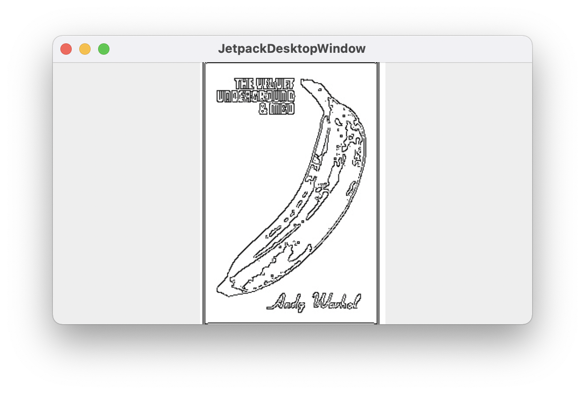

## Complete with sliders

Now we wrap the rest of the code with the sliders, by creating our own CustomComponent, *MyCustomOrigamiComponent*. Here we are simply taking values from two sliders, and using the values as threshold1 and threshold2 for the Canny filter. 

This component will use the MutableState value from the drag and drop settings.

```kotlin

@Composable
fun MyCustomOrigamiComponent(name:MutableState<String>) {

    if (name.value == "") {
        Text("Drop a file . . .")
    } else {

        val value = remember { mutableStateOf(10.0F) }
        val value2 = remember { mutableStateOf(10.0F) }
        val filter = Canny()
        filter.threshold1 = value.value.toInt()
        filter.threshold2 = value2.value.toInt()

        Column {
            Text(value.value.toString())
            Slider(steps = 100, valueRange = 1f..250f, value = value.value, onValueChange = {
                value.value = it
            })
            Text(value2.value.toString())
            Slider(steps = 100, valueRange = 1f..250f, value = value2.value, onValueChange = {
                value2.value = it
            })

            Image(
                bitmap = asImageAsset2(filter.apply(imread(name.value))),
                contentDescription = "Icon",
                modifier = Modifier.fillMaxSize())
        }
    }
}
```

And now the core application code is just calling that CustomComponent:

```
MaterialTheme {
        MyCustomOrigamiComponent(name)
}
```

Now, by playing with the two sliders, you can see instant update of the Image.

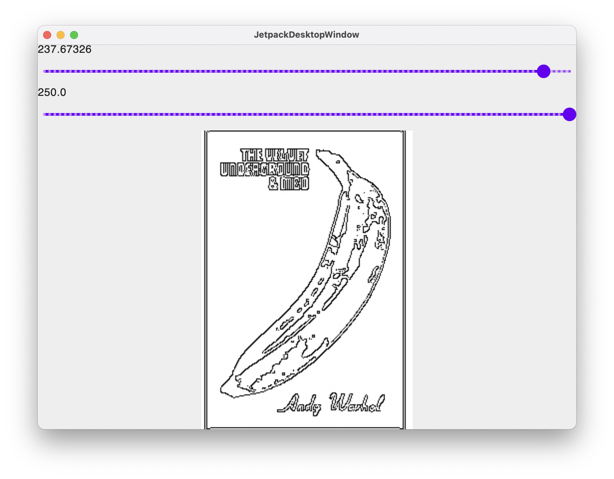

 Et voila.